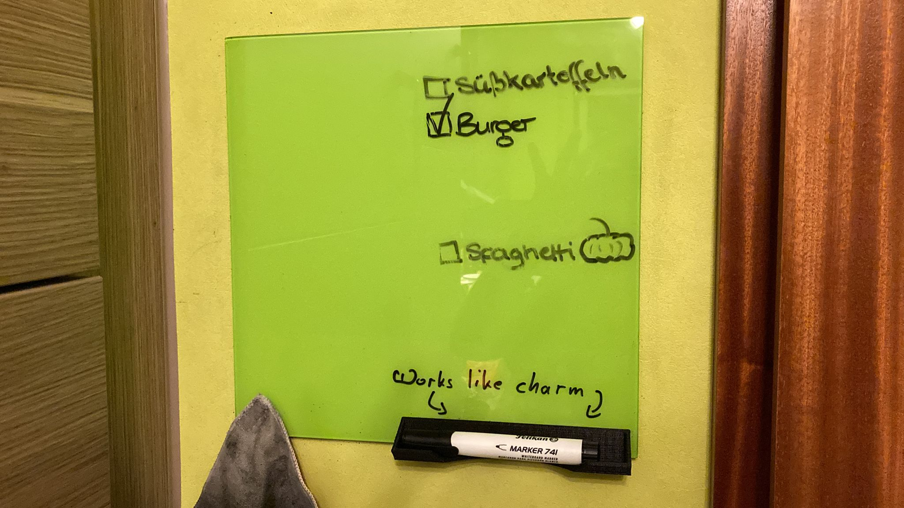

# A holder for a glass board marker

We've got this glass board in our kitchen and needed a place to store the glass board marker.

No design on Thingiverse did quite fit to my expectations:

- not too big (for 1 marker)
- can be clipped at the bottom of a glass board
- has an opening for easily picking up the marker

So I made that one.

On the back, I fixed it with some double-sided foam adhesive tape and we've
been using the holder ever since, without any problems. 

Also find this thing on [Thingiverse](https://www.thingiverse.com/thing:5180538).

